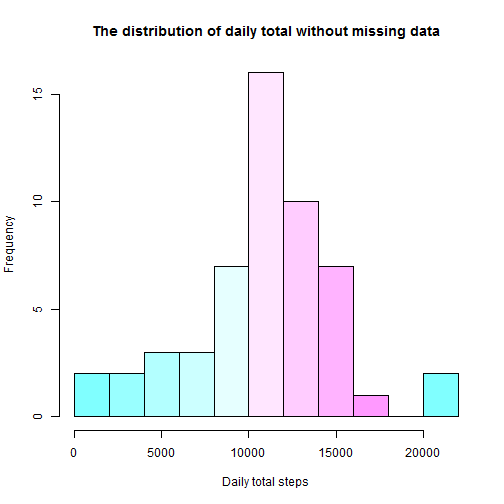
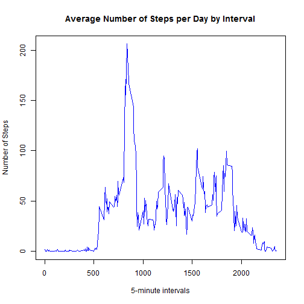
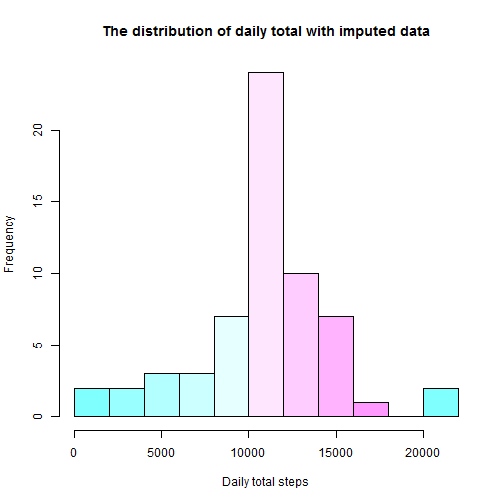
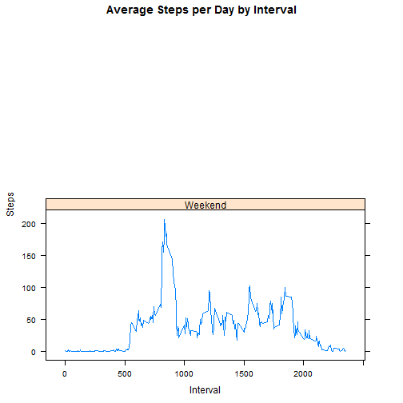

## Loading and preprocessing the data

The current directory have to contain the activity.csv file


```r
data <- read.csv("activity.csv")
```

Next step is to create a subset of data with no missing values in steps variable

```r
data1 <- subset(data, !is.na(data$steps))
```

## What is mean total number of steps taken per day?
We generate a histogram with daily total steps, and then calculate mean and median

```r
dailySum <- tapply(data1$steps, data1$date, sum)
hist(x=dailySum,
     breaks=10,
     col=cm.colors(10),
     xlab="Daily total steps",
     ylab="Frequency",
     main="The distribution of daily total without missing data")
```




```r
dailySum <- dailySum[!is.na(dailySum)]
cat("The mean is",mean(dailySum),"and the median is",median(dailySum))
```

```
## The mean is 10766.19 and the median is 10765
```

## What is the average daily activity pattern?
We do next steps\
* Calculate average steps for each interval for all days\
* Plot the Average Number Steps per Day by Interval\
* Find interval with most average steps\

```r
intervalAverage <- aggregate(steps ~ interval, data1, mean)
plot(intervalAverage$interval,
     intervalAverage$steps, 
     type="l", 
     col="blue", 
     xlab="5-minute intervals", 
     ylab="Number of Steps",
     main="Average Number of Steps per Day by Interval")
```




```r
max <- intervalAverage[which.max(intervalAverage$steps),1]
cat("So, The 5-minute interval containing the maximum number of steps is", max)
```

```
## So, The 5-minute interval containing the maximum number of steps is 835
```

## Imputing missing values
For calculating the total of missing values we just sum rows with NA of original dataset (data)

```r
sum(is.na(data$steps))
```

```
## [1] 2304
```
So the original dataset has 2304 rows with missing data.

Now, we create a new data frame that is equal to the original dataset but with the missing data filled in with the mean of existing values

```r
data2 <- data
ndx <- is.na(data2$steps)
int_avg <- tapply(data1$steps, data1$interval, mean, na.rm=TRUE)
data2$steps[ndx] <- int_avg[as.character(data2$interval[ndx])]
```

We create a new histogram with imputed data

```r
dailySum2 <- tapply(data2$steps, data2$date, sum)

hist(x=dailySum2,
     breaks=10,
     col=cm.colors(10),
     xlab="Daily total steps",
     ylab="Frequency",
     main="The distribution of daily total with imputed data")
```



So, we calculate the new mean and median, with imputed data

```r
cat("The new mean is",mean(dailySum2),"and the new median is",median(dailySum2))
```

```
## The new mean is 10766.19 and the new median is 10766.19
```
Compare with the original mean 10766 and median 10765, the mean doesn't change, and the median has a small change.\
The impact of imputing missing data is now we have higher frequency counts in the histogram at the center region (close to the mean).

## Are there differences in activity patterns between weekdays and weekends?
First we create a new factor variable "wk" in the dataset with two levels - "weekday" and "weekend"

```r
weekdays <- c("Monday", "Tuesday", "Wednesday", "Thursday", 
              "Friday")
data2$wk = as.factor(ifelse(is.element(weekdays(as.Date(data2$date)),weekdays), "Weekday", "Weekend"))

stepsByInt <- aggregate(steps ~ interval + wk, data2, mean)
```
Finally, we plot containing a time series plot (i.e. type = "l") of the 5-minute interval (x-axis) and the average number of steps taken, averaged across all weekday days or weekend days (y-axis)

```r
library(lattice)
with (stepsByInt, {
xyplot(steps ~ interval|wk, main="Average Steps per Day by Interval",xlab="Interval", ylab="Steps",layout=c(1,2), type="l")
})
```


